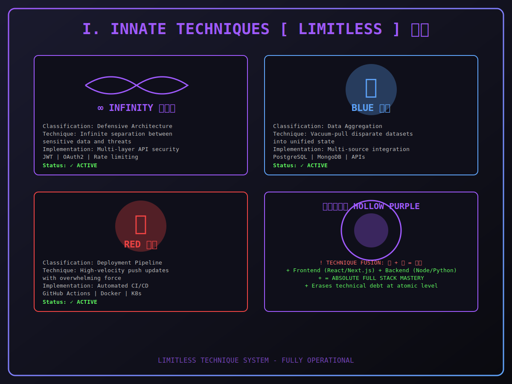
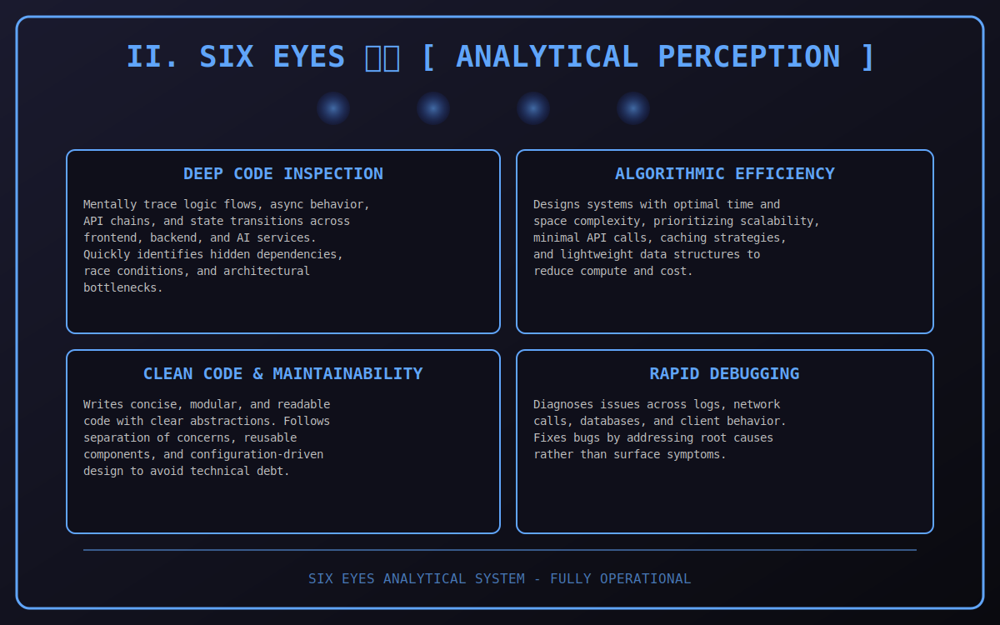
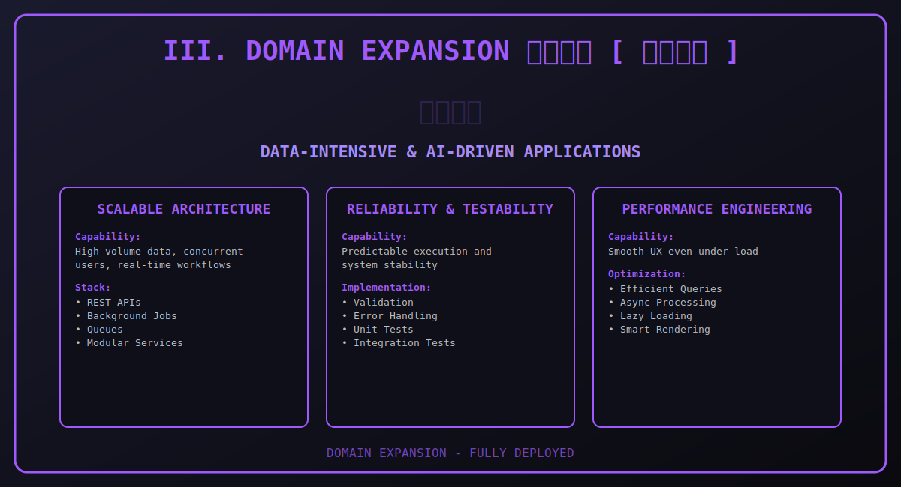

---

### **『 THE HONORED ONE 』** `最強の術師`

*"Throughout Heaven and Earth, I alone am the honored one."*

  

 

  

 

  

 

---

### **I. INNATE TECHNIQUES 『LIMITLESS』**
*Advanced Full-Stack Architectures*
- **Infinity**: Multi-layer security & data isolation.
- **Blue**: High-speed data aggregation & vacuuming.
- **Red**: Rapid CI/CD & deployment repulsion.
- **Hollow Purple**: Absolute full-stack mastery fusion.

 
 

### **II. SIX EYES 『ANALYTICAL PERCEPTION』**
*Deep Code & System Inspection*
- **Deep Inspection**: Mental tracing of logic flows.
- **Efficiency**: Zero-waste algorithmic design.
- **Clean Code**: Modular & readable abstractions.
- **Rapid Debugging**: Root-cause diagnostics.

 
 

### **III. DOMAIN EXPANSION 『UNLIMITED INFORMATION』**
*High-Performance Environments*
- **Immersive UX**: Context-aware interfaces.
- **Data Scaling**: Unlimited information processing.
- **AI Integration**: Living, breathing neural systems.
- **Scope Control**: Total control over the runtime environment.

 
 

### **IV. REVERSE CURSED TECHNIQUE 『RESTORATION』**
*System Healing & Optimization*
- **Refactoring**: Turning technical debt into assets.
- **Optimization**: Converting energy waste into performance.
- **Legacy Healing**: Modernizing deprecated systems.
- **Stability**: Ensuring 99.9% uptime and resilience.

 
 

### **V. COMBAT PROWESS 『EXECUTION』**
*Operational Excellence*
- **Precision**: Pixel-perfect front-end execution.
- **Power**: Heavy-duty back-end processing.
- **Speed**: Minimal latency & fast response times.
- **Strategy**: Agile methodology & rapid iteration.

 
 

### **VI. SORCERER PROFILE 『IDENTIFICATION』**
*The Special Grade Developer*
- **Rank**: Special Grade (Level 100 Mastery).
- **Specialty**: Full-Stack AI Engineering.
- **Cursed Tool**: VS Code | Terminal | Git.
- **Goal**: Dominating the digital landscape.

 

---

## **『 DOMAIN EXPANSION: COMPLETE 』**

**© 2026 Detective GOJO SATORU. | Special Grade Developer | All Systems Online**

*"In the world of development, there are those who create, and those who dominate. I do both."*

