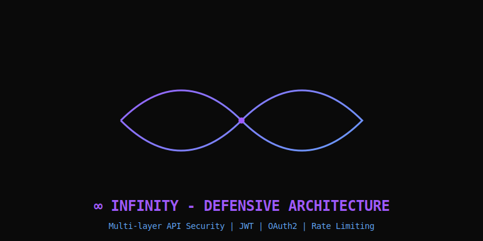
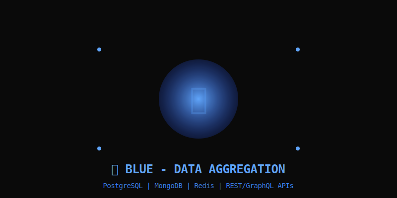
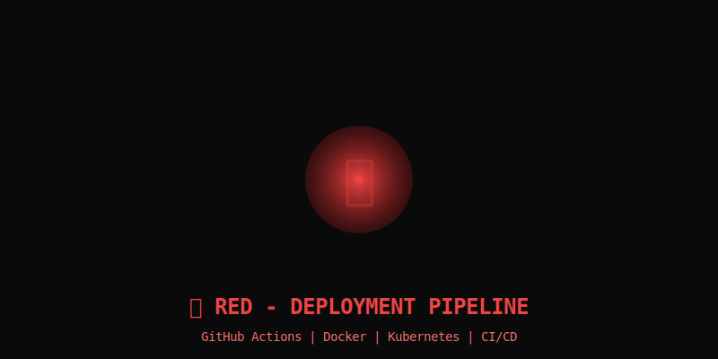
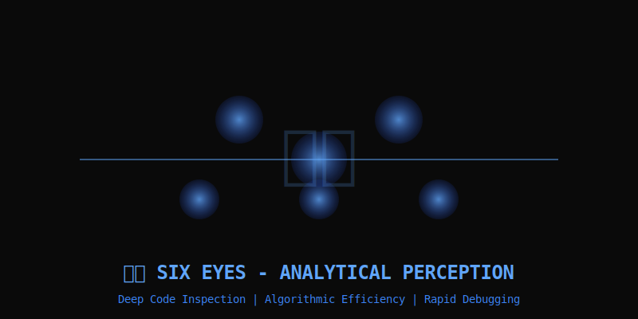

---

<div align="center">

### **『 THE HONORED ONE 』** `最強の術師`

*"Throughout Heaven and Earth, I alone am the honored one."*
<div align="center">
  
</div>
<br/>

<div align="center">
  
[](https://shivarajm8234.github.io/shivarajm8234/)
[](#i-innate-techniques--limitless-)
[](mailto:shivarajmani2005@gmail.com)

</div>


<br/>

<div id="contact">
  
[](https://www.linkedin.com/in/mshivaraj/)
[](https://leetcode.com/u/shivarajm8234/)
[](mailto:shivarajmani2005@gmail.com)

</div>

<br/>


</div>

---

## **I. INNATE TECHNIQUES** `[ LIMITLESS ]` `術式`

<div align="center">
  


</div>

<table>
<tr>
<td width="50%" valign="top">

### **∞ INFINITY** `無下限`
```yaml
Classification: Defensive Architecture
Technique: Infinite separation between
           sensitive data and threats
Implementation: Multi-layer API security
                JWT | OAuth2 | Rate limiting
Status: ✓ ACTIVE
```

</td>
<td width="50%" valign="top">

### **NEUTRAL LIMITLESS** `順転術式`
```yaml
Classification: Traffic Control
Technique: Automatic threat interception
           before system impact
Implementation: Load balancing + filtering
                Nginx | Redis | DDoS protection
Status: ✓ ACTIVE
```

</td>
</tr>
</table>

<div align="center">
  


</div>

<table>
<tr>
<td width="50%" valign="top">

### **蒼 BLUE** `引力`
```yaml
Classification: Data Aggregation
Technique: Vacuum-pull disparate datasets
           into unified state
Implementation: Multi-source integration
                PostgreSQL | MongoDB | APIs
Status: ✓ ACTIVE
```

</td>
<td width="50%" valign="top">

<div align="center">
  


</div>

</td>
</tr>
</table>

<table>
<tr>
<td width="50%" valign="top">

### **赫 RED** `斥力`
```yaml
Classification: Deployment Pipeline
Technique: High-velocity push updates
           with overwhelming force
Implementation: Automated CI/CD
                GitHub Actions | Docker | K8s
Status: ✓ ACTIVE
```

</td>
<td width="50%" valign="top">

</td>
</tr>
</table>

<div align="center">



### **虚式「茈」 HOLLOW PURPLE**

```diff
! TECHNIQUE FUSION: 蒼 + 赫 = 虚式
+ Frontend (React/Next.js) + Backend (Node/Python)
+ = ABSOLUTE FULL STACK MASTERY
+ Erases technical debt at atomic level
```

</div>

---

<div align="center">
  


</div>

## **II. SIX EYES** `六眼` *[ ANALYTICAL PERCEPTION ]*

<div align="center">

```
┌─────────────────────────────────────────────────────────────┐
│ CAPABILITY              │ IMPLEMENTATION                    │
├─────────────────────────────────────────────────────────────┤
│ DEEP CODE INSPECTION    │ Mentally trace logic flows,      │
│                         │ async behavior, API chains, and   │
│                         │ state transitions across stack.   │
│                         │ Identifies race conditions and    │
│                         │ architectural bottlenecks.        │
├─────────────────────────────────────────────────────────────┤
│ ALGORITHMIC EFFICIENCY  │ Optimal time/space complexity.    │
│                         │ Minimal API calls, caching,       │
│                         │ lightweight data structures.      │
├─────────────────────────────────────────────────────────────┤
│ CLEAN CODE PRINCIPLES   │ Modular, readable abstractions.   │
│                         │ Separation of concerns, reusable  │
│                         │ components, zero technical debt.  │
├─────────────────────────────────────────────────────────────┤
│ RAPID DEBUGGING         │ Root cause analysis across logs,  │
│                         │ network calls, databases, and     │
│                         │ client behavior.                  │
└─────────────────────────────────────────────────────────────┘
```

</div>

---

<div align="center">
  


</div>

## **III. DOMAIN EXPANSION** `領域展開` *[ 無量空処 ]*

<div align="center">

### **『 DATA-INTENSIVE & AI-DRIVEN APPLICATIONS 』**

</div>

```typescript
interface DomainExpansion {
  scalableArchitecture: {
    capability: "High-volume data, concurrent users, real-time workflows";
    stack: ["REST APIs", "Background Jobs", "Queues", "Modular Services"];
  };
  
  reliabilityAndTesting: {
    capability: "Predictable execution and system stability";
    implementation: ["Validation", "Error Handling", "Unit Tests", "Integration Tests"];
  };
  
  performanceEngineering: {
    capability: "Smooth UX even under load";
    optimization: ["Efficient Queries", "Async Processing", "Lazy Loading", "Smart Rendering"];
  };
}
```

---

## **IV. REVERSE CURSED TECHNIQUE** `反転術式` *[ ENERGY CONTROL ]*

<div align="center">

| TECHNIQUE | APPLICATION |
|:---|:---|
| **Self-Healing & Fault Tolerance** | Designs systems with retries, graceful fallbacks, health checks, and automated recovery mechanisms to reduce downtime. |
| **Continuous Skill Absorption** | Rapidly learns and applies new frameworks, APIs, AI models, and tools based on project needs rather than trends. |
| **Deep Focus Execution** | Capable of long, uninterrupted development sessions with high cognitive load—maintaining accuracy, structure, and momentum. |

</div>

---

## **V. COMBAT PROWESS** `戦闘能力` *[ TACTICAL DEVELOPMENT ]*

```python
class TacticalExecution:
    def rapid_prototyping(self):
        """Translates vague ideas into working prototypes quickly,
        validating concepts before scaling."""
        return "MVP in record time"
    
    def end_to_end_design(self):
        """Handles full lifecycle:
        requirements → architecture → development → deployment → optimization"""
        return "Complete ownership"
    
    def mental_modeling(self):
        """Breaks complex problems into data flow, components,
        and edge cases before writing code—reducing rework."""
        return "Think first, code second"
    
    def project_ownership(self):
        """Independently manages complex projects, balances trade-offs,
        and ships functional, production-ready systems."""
        return "Autonomous execution"
```

---

## **VI. SORCERER PROFILE** `術師プロフィール`

<div align="center">

```
╔════════════════════════════════════════════════════════════════╗
║                                                                ║
║         FULL STACK DEVELOPER & AI SYSTEMS ENGINEER             ║
║                                                                ║
║  ┌──────────────────────────────────────────────────────────┐  ║
║  │ FOCUS AREAS                                              │  ║
║  ├──────────────────────────────────────────────────────────┤  ║
║  │  • AI Agents & Automation                                │  ║
║  │  • Scalable Web Applications                             │  ║
║  │  • Performance Optimization                              │  ║
║  │  • System Design & Architecture                          │  ║
║  └──────────────────────────────────────────────────────────┘  ║
║                                                                ║
║  WORKING STYLE:                                                ║
║    High-discipline, low-noise, execution-first.                ║
║    Prefers results over visibility.                            ║
║                                                                ║
║  REPUTATION:                                                   ║
║    Solves complex, ambiguous technical problems                ║
║    that require both creativity and precision.                 ║
║                                                                ║
║  STATUS: SPECIAL GRADE DEVELOPER                               ║
║                                                                ║
╚════════════════════════════════════════════════════════════════╝
```

</div>

---

<div align="center">

**『 DOMAIN STATUS: ACTIVE 』**

<sub>© 2026 Detective L. | All Systems Online</sub>

</div>
